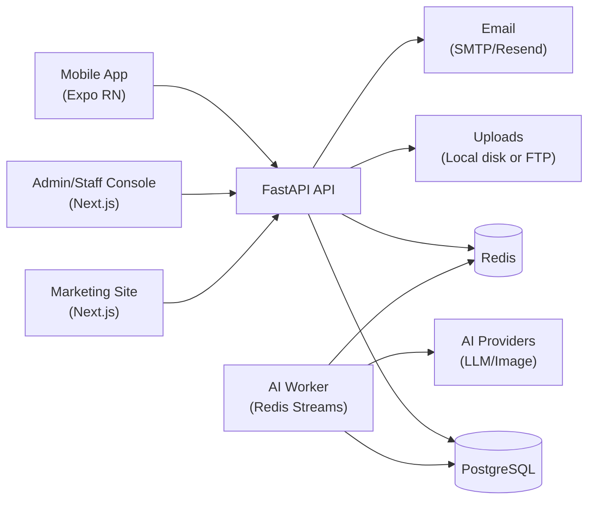

# GlucoForager

GlucoForager is a mobile-first diabetes-friendly food assistant with a production backend and an internal admin/staff console. Beyond “recipe generation”, this repo includes a full operational system: staff roles & permissions, work plans, daily work logs, requests/approvals, inbox, notifications, asset libraries, payroll views, and a marketing site.

## Tech Stack
- **Backend**: FastAPI, SQLAlchemy, Alembic, PostgreSQL, Redis
- **AI**: asynchronous jobs + provider fallback (text/vision), optional recipe image generation (Runware/Gemini)
- **Admin/Staff Console + Marketing**: Next.js (App Router) + Tailwind
- **Mobile**: Expo React Native + EAS (updates/build/submit)

## Repository Layout
- `backend/`: FastAPI backend (REST API), PostgreSQL models/migrations, AI job engine, email + file storage adapters.
- `landing-page/`: Next.js (App Router) marketing site **and** staff/admin console UI (role-based).
- `Mobile-GApp/`: Expo React Native mobile app (EAS updates/builds).
- `docker-compose.yml`: Local/prod-ish compose for `api`, `worker`, `db`, `redis`.

## High-Level Architecture

## Backend (FastAPI) Design
- **API surface**: Mobile endpoints + internal staff/admin endpoints. Interactive docs are available via FastAPI (OpenAPI/Swagger).
- **Data layer**: PostgreSQL (SQLAlchemy) for core product data, staff operations data, and AI job state/results.
- **AI is asynchronous by default**: AI requests create `ai_jobs` and return quickly; background workers generate results and the client polls/reads job status.
- **Operational features**: staff inbox, tickets, requests/approvals, work plans & milestones, work logs (rich text notes/summary), payroll views, notifications and badge counts, file uploads with per-feature limits.

## System Design Highlights
- **Async-first AI**: request/response returns fast (job id + status); heavy work runs in workers with bounded concurrency.
- **Backpressure & parallelism controls**: separate pools for text vs vision (`AI_JOB_RUNNER_TEXT_WORKERS`, `AI_JOB_RUNNER_VISION_WORKERS`).
- **Scheduled/triggered operations**: scheduled work-plan tasks become visible at “show time” and drive notification badges (see `WORK_PLANS_SCHEDULER_*` in `backend/.env.example`).
- **Storage abstraction**: consistent upload handling across modules, backed by local disk in dev or FTP on shared hosting.
- **Role-based operations**: the admin/staff console is designed for real ops workflows (approvals, auditability, soft delete patterns where needed).

## AI Job System (Resilience + Parallel Optimization)
The system is designed to stay responsive even when AI providers are slow or rate-limited.

- **Queue backends** (see `backend/.env.example`):
  - `AI_QUEUE_BACKEND=redis` (recommended): enqueue to Redis Streams; process in `glucoforager-worker` (`backend/app/workers/ai_jobs.py`).
  - `AI_QUEUE_BACKEND=db`: fallback “lightweight in-process runner” using DB polling and `SKIP LOCKED` (`backend/app/services/ai_job_runner.py`).
- **Bounded parallelism** (separate pools):
  - `AI_JOB_RUNNER_TEXT_WORKERS` (text jobs)
  - `AI_JOB_RUNNER_VISION_WORKERS` (vision/batch jobs)
- **Provider strategy**: primary + fallback models/providers, strict timeouts/budgets, output validation, and clear failure reasons (operational vs invalid input).
- **Recipe images**: generated via `RECIPE_IMAGE_PROVIDER` (e.g. `runware` or `gemini`) after recipe JSON is accepted.

## Admin & Staff Console (Next.js)
Located under `landing-page/` (App Router + Tailwind). Key concepts:
- **Role-based access** (Admin/HR/Operations/Marketer, etc.).
- **Staff operations**: staff management, role assignment, editable staff fields (including bank details where enabled).
- **Work system**: work plans + milestones, scheduled tasks (show at a future time), daily work logs with “mark done”/“mark unfinished” (reason), attachments, and admin visibility into tasks + notes + summary.
- **Communication**: staff inbox messaging, help tickets, notifications + badge counts.
- **Content ops**: blog tooling (including scheduling/publishing where enabled) and SSR/SEO improvements on the marketing site.

## Mobile App (Expo / EAS)
Located under `Mobile-GApp/`.

App identifiers (from `Mobile-GApp/app.json`):
- iOS bundle id: `com.glucoforager.app`
- Android package: `com.glucoforager.app`

EAS configuration:
- `Mobile-GApp/eas.json` (development/preview/production channels).

## File Storage (Local Disk or FTP)
For staff assets/attachments, the backend supports:
- **Local storage** (dev): writes under `backend/uploads/` and serves via `/uploads`.
- **FTP storage** (shared hosting): configure `*_STORAGE_BACKEND=ftp`, base dirs, and public base URLs.

Configured modules include Library, Inbox attachments, Requests attachments, MyDrive/StaffDrive, and recipe image uploads (see `backend/.env.example`).

## Running Locally (Docker Compose)
From repo root:
- Start everything: `docker compose up -d --build`
- API: `http://localhost:8011` (or your `HOST_API_PORT`)
- Stop: `docker compose down`

Inside Docker, services are wired as:
- API/worker → Postgres: `postgresql://glucoforager:glucoforager@db:5432/glucoforager`
- API/worker → Redis: `redis://redis:6379/0`

## Production Notes (Small Servers)
This project can run on small instances (e.g. 1 vCPU / 2 GB), but AI workloads must be bounded:
- Reduce worker concurrency via `AI_JOB_RUNNER_TEXT_WORKERS` / `AI_JOB_RUNNER_VISION_WORKERS`.
- Keep `AI_QUEUE_BACKEND=redis` so the API remains responsive under burst traffic.
- Prefer async jobs + polling for AI results instead of synchronous “wait for LLM” requests.

## Configuration
Copy and edit:
- `backend/.env.example` → `backend/.env`

Never commit secrets (API keys, SMTP passwords, FTP credentials, etc.).
